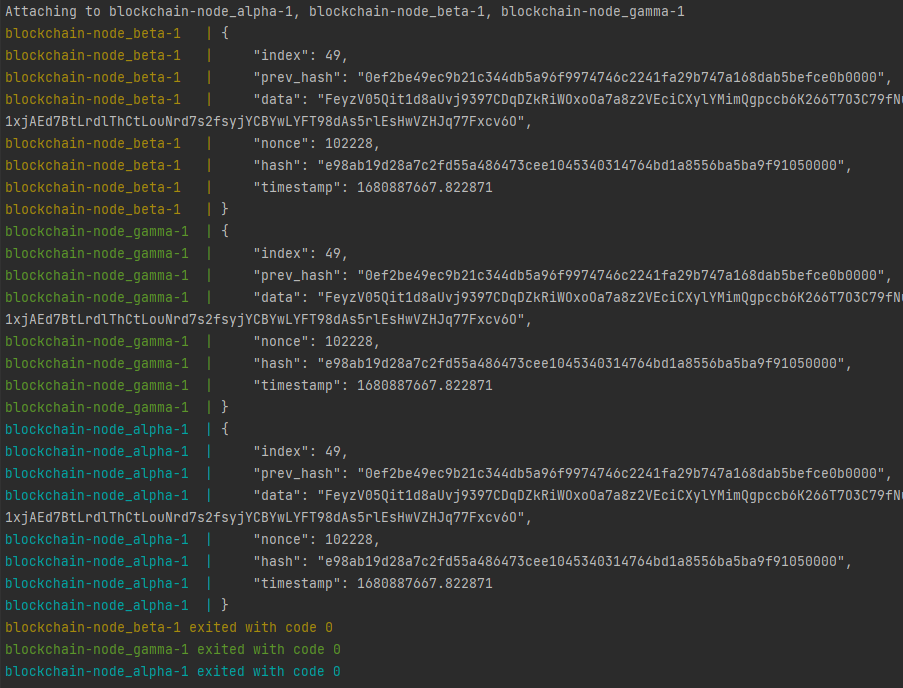

main: 
develop: 

## Блокчейн
Учебный проект по реализации блокчейн-сети из трех узлов. 
Сетевое взаимодействие реализовано при помощи UDP-сокетов. 
Развертывание осуществляется при помощи Docker Compose.

***

### Результаты работы
Результат работы блокчейн-сети при запуске через Docker Compose:

### Docker Compose
Для запуска блокчейн-сети при помощи Docker Compose:

    docker-compose build
    docker-compose up

При необходимости можно включить журналирование работы узлов в файле **docker-compose.yaml**:

    version: "3"
    
    services:
    
      node_alpha:
        build: .
        network_mode: "host"
        command: python -u main.py 127.0.0.1 60001 [False] -> True
    
      node_beta:
        build: .
        network_mode: "host"
        command: python -u main.py 127.0.0.1 60002 [False] -> True
    
      node_gamma:
        build: .
        network_mode: "host"
        command: python -u main.py 127.0.0.1 60003 [False] -> True

### Тестирование

Реализованы тесты модульного, интеграционного и системного уровня + тестовый пайплайн Github Actions
с запуском тестов на разных платформах.

Модульные тесты:
* Генерация блока
* Прерывание генерации блока
* Генерация цепочки блоков
* Отбрасывание "хвоста" цепочки

Интеграционые тесты:
* Получение подходящего блока от соседних узлов
* Получение неподходяего блока от соседних узлов
* Отправка блока соседним узлам
* Проверка синхронизации узлов в цепи
* Проверка работы трех узлов

Системные тесты:
* Проверка закрытия UDP-сокетов